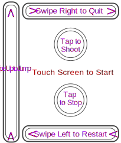
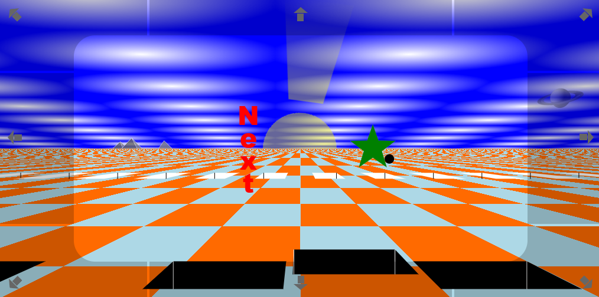
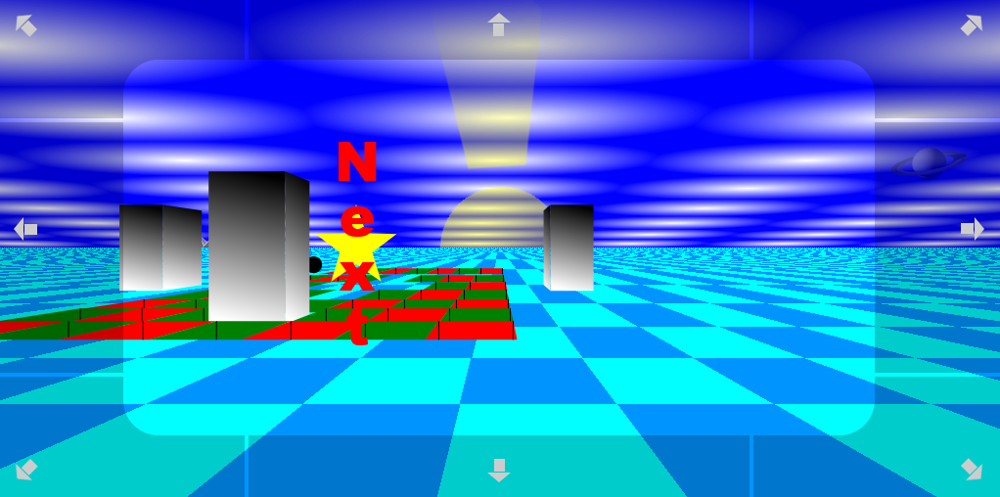
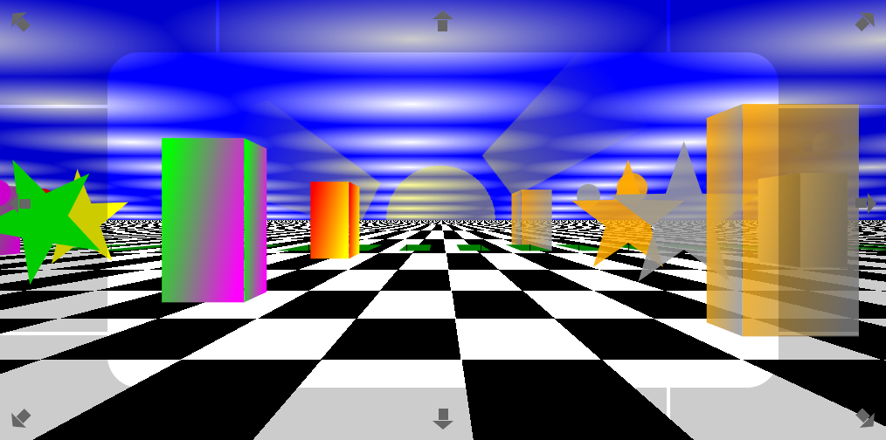
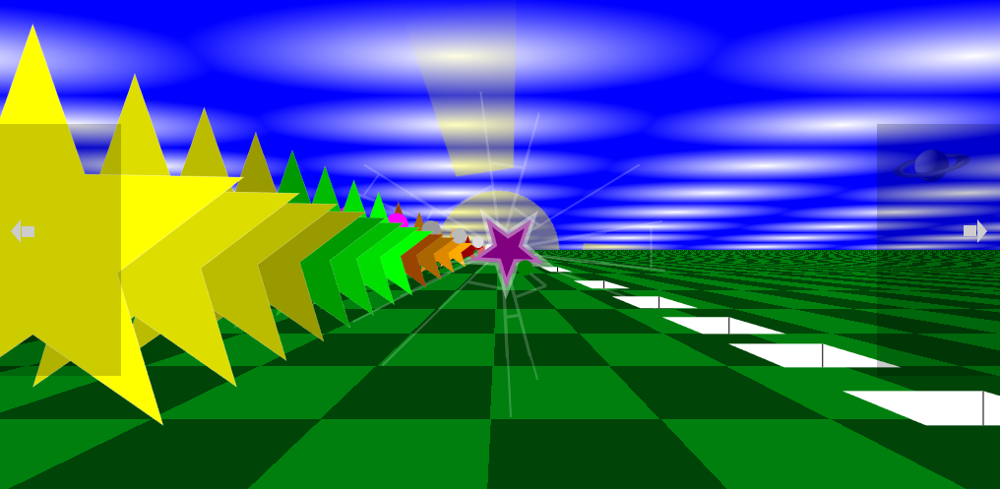
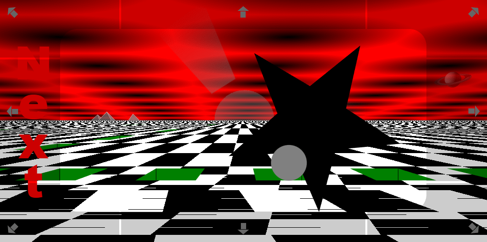
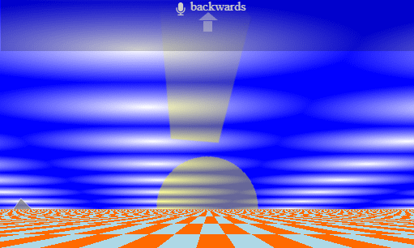

## This is a 3D vanilla JavaScript game.

[Play Game](https://steenhansen.github.io/3d-game/)

## Mobile Frames Per Second

    Galaxy S24 FE (2024)
        Chrome 60 to 80 fps
        Samsung 60 fps
        Firefox 45 fps

    Galaxy SM-A520 (2017)
        Chrome 6 fps - when degraded
        Firefox 3 fps - when degraded
        Samsung does not work

## Desktop Frames Per Second

    AMD Ryzen 7 3700X (2019)
        Chrome 60 fps
        Opera 60 fps
        Brave 60 fps
        Edge 60 fps
        Firefox 50 to 60 - when degraded

    Intel i5-2500 (2011)
        Edge 25 fps - when degraded

## Mobile Controls

    Swipe Up to Jump
    Swipe Right to Quit
    Swipe Left to Restart

    Tap to Shoot
    Tap to Stop

 

## Area 1

    Playfield bounded front and back. Must jump the black ditch.

[normal](https://steenhansen.github.io/3d-game/area-1-jump/index.html), [fps](https://steenhansen.github.io/3d-game/area-1-jump/index.html?display-fps=show), [debug](https://steenhansen.github.io/3d-game/area-1-jump/index.html?env-type=debug&display-fps=show), [degraded](https://steenhansen.github.io/3d-game/area-1-jump/index.html?scroll-quality=course&graphics-style=simple&display-fps=show)

 

## Area 2

    Playfield has no bounds, is infinite. Must carom shot off of pylon.

[normal](https://steenhansen.github.io/3d-game/area-2-carom/index.html), [fps](https://steenhansen.github.io/3d-game/area-2-carom/index.html?display-fps=show), [debug](https://steenhansen.github.io/3d-game/area-2-carom/index.html?env-type=debug&display-fps=show), [degraded](https://steenhansen.github.io/3d-game/area-2-carom/index.html?scroll-quality=course&graphics-style=simple&display-fps=show)

 

## Area 3

    Playfield bounded on all sides. Must shoot all enemies.

[normal](https://steenhansen.github.io/3d-game/area-3-shoot/index.html), [fps](https://steenhansen.github.io/3d-game/area-3-shoot/index.html?display-fps=show), [debug](https://steenhansen.github.io/3d-game/area-3-shoot/index.html?env-type=debug&display-fps=show), [degraded](https://steenhansen.github.io/3d-game/area-3-shoot/index.html?scroll-quality=course&graphics-style=simple&display-fps=show)

 

## Area 4

    Playfield bounded on left and right. Must shoot all enemies, and then jump to finish.

[normal](https://steenhansen.github.io/3d-game/area-4-fast/index.html), [fps](https://steenhansen.github.io/3d-game/area-4-fast/index.html?display-fps=show), [debug](https://steenhansen.github.io/3d-game/area-4-fast/index.html?env-type=debug&display-fps=show), [degraded](https://steenhansen.github.io/3d-game/area-4-fast/index.html?scroll-quality=course&graphics-style=simple&display-fps=show)

## Death

    Area 3 death.

 

## Speech

Only Chrome and Edge browsers support the Web Speech API.

The commands are "Left", "right", "forward", "backwards", "jump", "stop", "shoot", "quit", and "restart".

On mobile there is a non-stop intermitant chime as the browser automatically turns off speech recognition, causing the program to re-start recognition.

[Chrome and Edge Only](https://steenhansen.github.io/3d-game/index.html?speak-input=talk)

## Firefox

Updates the horizontal lines on the checkerboard playfield slowly.

Two visible Firefox games cause issues while other browsers are fine with four distinct visible games.
